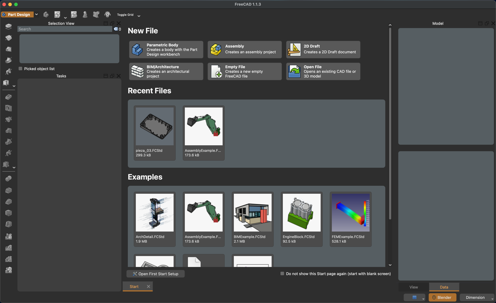
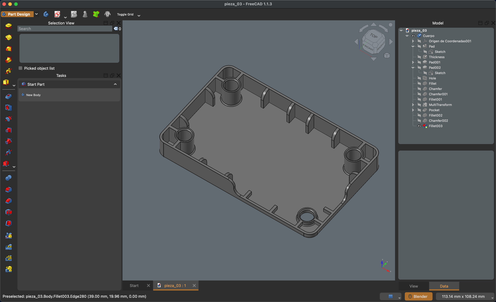

# Convergence

**Convergence** is a professional dark theme and FreeCAD Preference Pack
designed for users who work extensively with CAD, 3D modeling,
visualization, and technical design.

The project focuses on a restrained, high-contrast interface, a neutral
viewport, clear technical visualization, and a consistent visual
language across FreeCAD's workbenches and editors.

> **Project status:** Active development\
> **Current package version:** 1.0.0\
> **Target FreeCAD version:** 1.1.3\
> **License:** MIT

## Visual Preview





## Overview

Convergence was created to provide FreeCAD with a professional dark
working environment suitable for long modeling sessions and technical
workflows.

The theme combines:

-   A neutral blue-gray 3D viewport.
-   Dark Qt interface panels and toolbars.
-   Carefully tuned text and control contrast.
-   CAD-oriented Sketcher colors.
-   Persistent viewport appearance defaults.
-   Persistent lighting defaults.
-   A 4.00 default line width for visible model edges.
-   Styling for FreeCAD overlay panels.
-   Customized colors for common FreeCAD modules such as Draft, Arch,
    Spreadsheet, TechDraw, the Python/editor environment, and Sketcher.

The visual language is intentionally restrained rather than relying on a
highly saturated "gaming" or neon appearance.

## Design goals

Convergence is intended to make FreeCAD feel visually coherent for
professional users who move between different CAD and DCC environments.

The main design principles are:

1.  **Neutrality** --- the interface should stay visually quiet so
    geometry remains the primary focus.
2.  **Legibility** --- text, controls, selection states, and technical
    annotations should remain readable on dark surfaces.
3.  **Consistency** --- the same visual language should be maintained
    across the main interface, dock panels, overlays, and viewport.
4.  **Technical clarity** --- Sketcher geometry, constraints,
    dimensions, construction geometry, and other technical states use
    distinct colors.
5.  **Persistent defaults** --- the Preference Pack configures important
    FreeCAD visual preferences instead of relying only on Qt stylesheet
    rules.
6.  **Professional appearance** --- the result should remain appropriate
    for engineering, architecture, product design, modeling, and
    visualization workflows.

## Core visual configuration

### 3D viewport

The primary viewport background is based on:

-   **Viewport background:** `#636B72`
-   **Default shape color:** `#808080`
-   **Light source colors:** `#DCDCDC`

The viewport is intentionally neutral and avoids a pure black
background. This provides enough separation for medium-gray geometry
while maintaining a dark overall environment.

### Default shape appearance

Convergence configures:

``` text
DefaultShapeColor = #808080FF
```

This establishes a neutral gray default appearance for shapes.

The theme also configures:

``` text
DefaultShapeLineWidth = 4
```

so the default line width is set to **4.00**.

These are FreeCAD preference values rather than QSS-only styling.

### Lighting

The Preference Pack configures all four FreeCAD viewport light sources
to the same neutral light color:

``` text
HeadlightColor    = #DCDCDCFF
BacklightColor    = #DCDCDCFF
FillLightColor    = #DCDCDCFF
AmbientLightColor = #DCDCDCFF
```

This was chosen to keep the viewport illumination neutral and avoid
introducing an unwanted color cast into shaded geometry.

## Sketcher

Sketcher receives dedicated colors for different geometry and constraint
states.

The current configuration includes preferences for:

-   Sketch edges.
-   Sketch vertices.
-   Edited edges.
-   Edited vertices.
-   Construction geometry.
-   External geometry.
-   Invalid sketches.
-   Fully constrained geometry.
-   Internal aligned geometry.
-   Fully constrained elements.
-   Fully constrained construction elements.
-   Fully constrained internal alignment.
-   Fully constrained construction points.
-   Constraint icons.
-   Non-driving/reference dimensional constraints.
-   Driving/constrained dimensions.
-   Expression-based constraints.
-   Deactivated constraints.
-   Cursor text.
-   Cursor crosshair.
-   Create-line visualization.

The relevant FreeCAD preference names are stored directly in
`Convergence.cfg`, allowing Sketcher appearance to be configured as part
of the Preference Pack.

## Other FreeCAD areas

The configuration also includes dedicated preferences for several
FreeCAD components.

### Draft

Includes settings for:

-   Grid transparency.
-   Construction color.
-   Grid color.
-   Snap color.

### Arch

Includes colors for:

-   Walls.
-   Structures.
-   Rebar.
-   Windows.
-   Window glass.
-   Panels.
-   Helper colors.
-   Default space colors.

### Spreadsheet

Includes colors for:

-   Aliased cell backgrounds.
-   Text.
-   Positive numbers.
-   Negative numbers.

### Start page

Includes colors for:

-   Backgrounds.
-   Background text.
-   Pages.
-   Page text.
-   Cards/boxes.
-   Links.
-   File thumbnail borders.
-   File thumbnail backgrounds.
-   File thumbnail selection.

### TechDraw

Includes a configured background color.

### Output window

Includes separate colors for:

-   Normal text.
-   Logging.
-   Warnings.
-   Errors.

### Editor

Includes syntax colors for:

-   Text.
-   Bookmarks.
-   Breakpoints.
-   Keywords.
-   Comments.
-   Block comments.
-   Numbers.
-   Strings.
-   Characters.
-   Class names.
-   Define names.
-   Operators.
-   Python output.
-   Python errors.
-   Current-line highlighting.

### Tree View

Includes colors for:

-   Tree editing.
-   Active tree items.

## Qt stylesheet

`Convergence.qss` provides the main Qt interface styling.

It defines the appearance of major FreeCAD UI elements including:

-   Main windows.
-   Dialogs.
-   Dock widgets.
-   Toolbars.
-   MDI subwindows.
-   Toolboxes.
-   Status bars.
-   Labels and links.
-   Text editors.
-   Property editors.
-   Task panels.
-   Action groups.
-   Buttons.
-   Combo boxes.
-   Spin boxes.
-   Line edits.
-   Tables.
-   Tree views.
-   Lists.
-   Tabs.
-   Scrollbars.
-   Menus.
-   Other Qt and FreeCAD-specific widgets.

The stylesheet uses a dark neutral UI palette with restrained accent
colors and is intended to remain visually consistent with the viewport.

## Overlay stylesheet

`overlay/Convergence-overlay.qss` customizes FreeCAD's overlay
interface.

It provides styling for:

-   Overlay tab widgets.
-   Overlay title bars.
-   Overlay splitter handles.
-   Overlay tool buttons.
-   Overlay property editors.
-   Overlay tree/list/table views.
-   Transparent overlay states.
-   Selection and focus states.
-   Overlay effects and hints.

The overlay stylesheet is loaded through:

``` xml
<FCText Name="OverlayActiveStyleSheet">Convergence-overlay.qss</FCText>
```

## Project structure

The Preference Pack is organized as follows:

``` text
Convergence/
├── package.xml
└── Convergence/
    ├── Convergence.cfg
    ├── Convergence.qss
    └── overlay/
        └── Convergence-overlay.qss
```

`package.xml` defines the FreeCAD package metadata.

`Convergence.cfg` contains FreeCAD preferences, including viewport,
Sketcher, lighting, colors, line width, module-specific settings, and
the stylesheet references.

`Convergence.qss` contains the main Qt stylesheet.

`Convergence-overlay.qss` contains styling specific to FreeCAD's overlay
system.

## Installation

Convergence is packaged as a FreeCAD Preference Pack.

### Manual installation

Copy the complete `Convergence` package into the appropriate FreeCAD
user package/addon location used by your FreeCAD installation.

The package must preserve its internal structure:

``` text
Convergence/
├── package.xml
└── Convergence/
    ├── Convergence.cfg
    ├── Convergence.qss
    └── overlay/
        └── Convergence-overlay.qss
```

Do not rename the inner project directory or the referenced stylesheet
files.

### Applying the theme

After installing the Preference Pack:

1.  Open FreeCAD Preferences.
2.  Locate the available Preference Packs/Themes.
3.  Select **Convergence**.
4.  Apply the pack.
5.  Press **Apply** in the Preferences dialog.

## Important behavior when developing or modifying the theme

FreeCAD stores applied preference values in its user configuration.

This means that editing `Convergence.cfg` after the Preference Pack has
already been applied does **not** necessarily cause the new values to
appear simply by closing and reopening FreeCAD.

During development, use this workflow:

``` text
Edit Convergence.cfg
        ↓
Open FreeCAD Preferences
        ↓
Reapply Convergence
        ↓
Press Apply
        ↓
Test the result
```

This is particularly important for viewport colors, lighting, Shape
Appearance, line width, and Sketcher colors.

If a value appears unchanged after editing the `.cfg`, reapply the
Preference Pack before assuming that the parameter is incorrect.

## Customization

Convergence is distributed as an editable FreeCAD Preference Pack.

The primary configuration files are:

``` text
Convergence.cfg
Convergence.qss
Convergence-overlay.qss
```

### Preference values

Use `Convergence.cfg` for FreeCAD parameters such as:

-   Viewport colors.
-   Shape appearance.
-   Line width.
-   Selection colors.
-   Sketcher colors.
-   Lighting.
-   Module-specific colors.
-   Editor colors.

### Interface styling

Use `Convergence.qss` for Qt interface styling.

Use `Convergence-overlay.qss` for overlay-specific styling.

When modifying the Preference Pack, keep the FreeCAD preference
hierarchy intact. In particular, lighting preferences belong under:

``` xml
<FCParamGroup Name="View">
    <FCParamGroup Name="LightSources">
        ...
    </FCParamGroup>
</FCParamGroup>
```

## Compatibility

Convergence is developed and tested against:

**FreeCAD 1.1.3**

Other FreeCAD versions may use different preference names, defaults, or
UI classes. Compatibility with other versions is therefore not
guaranteed unless explicitly tested.

The theme is intended for the standard FreeCAD desktop interface and its
associated workbenches.

## Relationship to other software

Convergence is an independent FreeCAD theme.

It is not an official theme of FreeCAD, Blender, or any other commercial
or open-source software project, and it is not affiliated with or
endorsed by those projects.

The theme's design is based on the author's own workflow requirements
and experience with professional 3D/CAD software. Similarities in visual
organization or color language are intentional usability decisions and
do not imply a direct software dependency or affiliation.

## License

Convergence is released under the **MIT License**.

See the repository license file for the complete license text.

## Credits

Created and maintained by **difrkaguilar**.

The project is built specifically for FreeCAD and makes use of FreeCAD's
Preference Pack mechanism and Qt stylesheet system.

## Contributing

Contributions, testing, issue reports, and suggestions are welcome.

When reporting a visual issue, please include:

-   FreeCAD version.
-   Operating system.
-   Active workbench.
-   Whether the issue concerns the viewport, Qt interface, overlay, or
    Preference Pack values.
-   A screenshot when possible.
-   The relevant preference or stylesheet section if you have modified
    the theme.

For changes to the visual system, please preserve the overall
Convergence design language and avoid introducing isolated colors that
reduce consistency between the interface and viewport.

## Known development considerations

The theme is still evolving.

Some FreeCAD viewport behaviors are implemented by FreeCAD's 3D
rendering and selection system rather than by Qt stylesheets. As a
result, not every visual state can be controlled through QSS alone.

In particular, selection and preselection rendering can involve
FreeCAD's 3D selection/overlay system and may behave differently from
ordinary viewport colors.

The project therefore distinguishes between:

-   FreeCAD preference parameters in `Convergence.cfg`.
-   Qt widget styling in `Convergence.qss`.
-   Overlay widget styling in `Convergence-overlay.qss`.
-   3D rendering behavior implemented internally by FreeCAD.

This distinction is important when extending the theme.

## Versioning

The package currently reports:

``` text
1.0.0
```

Version numbers follow the package version declared in `package.xml`.

Future releases should document changes to:

-   Preference values.
-   Sketcher colors.
-   Viewport colors.
-   Lighting.
-   Line width.
-   Qt stylesheet behavior.
-   Overlay styling.
-   FreeCAD compatibility.

## Roadmap

Future development may include:

-   Further refinement of Sketcher constraint colors.
-   Refinement of selection and preselection behavior.
-   Additional FreeCAD workbench-specific colors.
-   Continued visual consistency improvements.
-   Compatibility testing against future FreeCAD releases.
-   Documentation of additional configurable FreeCAD parameters.

## Disclaimer

Convergence is provided as an independent community project. It changes
FreeCAD user-interface and preference settings and does not modify
FreeCAD's source code.

Always keep a backup of your FreeCAD user preferences if you are testing
experimental versions of the theme.
